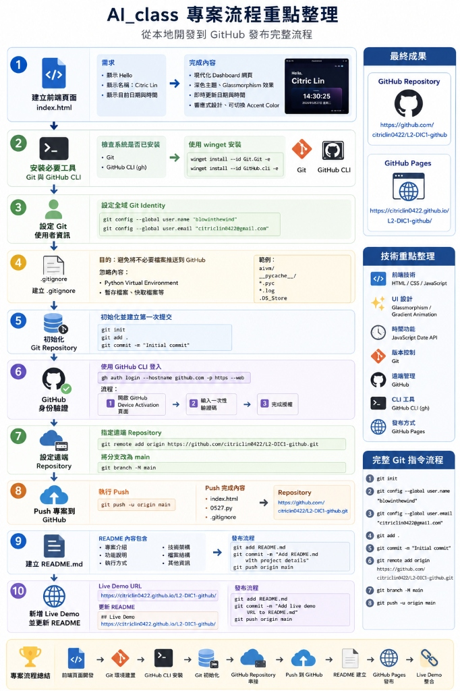

# 專案建置與部署工作報告

本報告詳細記錄了 **Citric Lin** 個人首頁與數位時鐘看板專案的開發、環境建置、Git 版本控制初始化、GitHub 遠端倉庫關聯，以及最終部署的完整執行過程。

## 📊 專案流程重點整理



---

## 🚀 執行階段與工作內容

### 第一階段：動態個人時鐘網頁開發 (`index.html`)
* **主要任務：** 撰寫單網頁應用程式，展現高質感的現代化視覺設計。
* **技術細節：**
  * **前端結構 (HTML5)：** 採用語意化標籤，建立個人介紹與即時時間看板。
  * **視覺設計 (Vanilla CSS3)：** 
    * 採用毛玻璃特效（Glassmorphism，包含 `backdrop-filter: blur(20px)`），使介面具備通透感。
    * 背景添加兩組動態漸變發光球體（Ambient Glow），並設定動畫使其微幅漂移以增加視覺層次。
    * 引進 Google Fonts 的 **Outfit** 字體以提升文字排版質感。
  * **動態邏輯 (ES6+ Javascript)：**
    * 建立每秒自動更新一次的即時時鐘邏輯，完美呈現精確的時間跳動。
    * 自動擷取本地端時間，並以符合閱讀習慣的完整格式顯示日期與星期。
  * **互動模組 (主題切換)：**
    * 設計互動式按鈕，提供 **Indigo (靛藍)**、**Emerald (祖母綠)**、**Amber (琥珀橘)** 三種主題切換。
    * 利用 CSS 自定義變數（CSS Variables）實現即時且流暢的色彩主題切換。

---

### 第二階段：本地環境檢測與 Git 初始化
* **環境檢驗：** 檢查系統環境時，發現系統環境變數中未包含 Git 執行檔。
* **工具安裝與環境建置：**
  1. 使用 Windows 內建的包管理器 `winget` 成功自動化安裝 **Git**。
  2. 使用 `winget` 成功安裝 **GitHub CLI (`gh`)** 以備後續認證需求。
* **Git 身分識別設定：**
  * 設定全域使用者名稱：`blowinthewind`
  * 設定全域電子郵件：`citriclin0422@gmail.com`
* **版本控制排除規則 (`.gitignore`)：**
  * 撰寫 `.gitignore` 排除專案內部的 Python 虛擬環境資料夾（`aivm/`）、編譯快取（`__pycache__/`）及環境變數檔案，確保提交到遠端倉庫的檔案結構乾淨且輕量。
* **初始化與首發提交：**
  * 在專案目錄中初始化 Git 倉庫。
  * 執行 `git add .` 與 `git commit -m "Initial commit"`，完成首次版本儲存。

---

### 第三階段：關聯 GitHub 遠端倉庫與部署
* **遠端倉庫綁定：**
  * 將本地 Git 倉庫與目標 GitHub 遠端路徑進行關聯：
    ```bash
    git remote add origin https://github.com/citriclin0422/L2-DIC1-github.git
    ```
  * 將預設分支名稱修改為符合現代標準的 `main`：
    ```bash
    git branch -M main
    ```
* **代碼上傳：**
  * 執行 `git push -u origin main`，順利將包含動態時鐘網頁在內的所有本機檔案安全推送至 GitHub 專案庫中。

---

### 第四階段：專案說明文件撰寫與優化 (`README.md`)
* **編寫 README.md：** 撰寫結構完整且圖文並茂的英文說明文件，詳細列出專案的架構、擁有的網頁特點、Python Tkinter 測試腳本的執行步驟以及相關技術規格。
* **新增 Live Demo 連結：**
  * 因應使用者需求，在 `README.md` 顯眼處新增了專案的 GitHub Pages 線上預覽網址：
    **👉 [https://citriclin0422.github.io/L2-DIC1-github/](https://citriclin0422.github.io/L2-DIC1-github/)**
  * 完成檔案更新後，將最新版的 `README.md` 即時推送至 GitHub 伺服器。

---

## 📂 專案檔案清單與成果

當前專案與遠端倉庫已完全同步，包含以下核心檔案：

| 檔案名稱 | 說明 | 狀態 |
| :--- | :--- | :--- |
| `index.html` | 精美個人介紹動態時鐘網頁，含主題切換與發光背景。 | 已推送 |
| `0527.py` | Tkinter 基礎視窗 Python 測試腳本。 | 已推送 |
| `.gitignore` | 設定排除 python 虛擬環境資料夾（`aivm/`）之規則。 | 已推送 |
| `README.md` | 說明文件，含專案特點、執行教學與 **Live Demo** 連結。 | 已推送 |
| `process_flow.jpg` | 專案建置與部署流程重點整理圖。 | 已推送 |
| `工作報告.md` | 本執行流程記錄文件（含流程整理圖）。 | 已推送 |


---

## 📈 總結與專案成果

1. 成功在本地開發出兼具質感與實用性的響應式時間個人看板。
2. 透過 `winget` 順利部署了 Git 與相關 CLI 基礎建設，補足系統開發所需環境。
3. 採用主流 Git 版本控制規範，實施排除與分支命名策略，將程式碼完整推送至 GitHub。
4. 設定並更新了 GitHub Pages 線上展示連結，提供直接點擊即可瀏覽的 Live Demo，達成預期目標。
